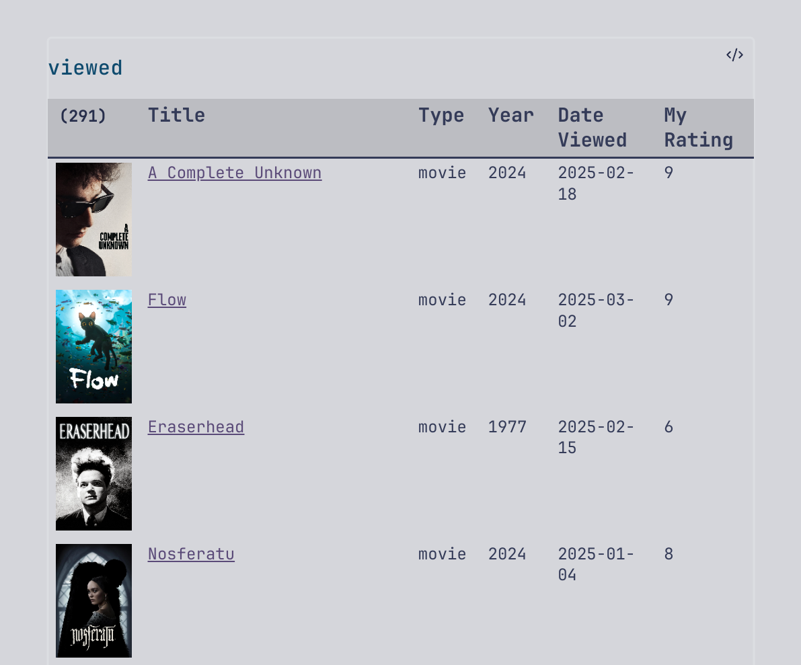

# metakultur

Metakultur is a CLI application written in Scala 3 that fetches metadata about cultural events from web APIs. It supports books, movies, and TV shows, with plans to expand to other events such as concerts, craft beer, theater plays, and more. It integrates nicely with Obsidian's Dataview plugin, exporting resources into markdown with frontmatter or YAML.

## Table of Contents
- [Demo](#demo)
- [Main Features](#main-features)
- [Usage](#usage)
- [Setup](#setup)
- [Obsidian Dataview Integration](#obsidian-dataview-integration)

## Demo


## Main Features

- Fetch resources by various IDs from APIs
- Search for resources using user queries
- Import data from IMDB or Goodreads dumps
- Support multiple output formats: console (default), JSON, YAML, markdown

## Usage

```bash
Usage: metakultur <COMMAND>

Commands:
  book
  movie
  tv

Common [options]:
  --usage                       Print usage and exit
  -h, -help, --help             Print help message and exit
  -f, --output-format string?   One of: json, yaml, md. (default: json)
  -o, --output string?          Path to output file
  -r, --rate                    Add personal rating details (default: false)

IMDB and Goodreads CSV import [options]:
  --from string?                Filter the CSV with records starting from this date (yyyy-MM-dd)
  --to string?                  Filter the CSV with records up to this date (yyyy-MM-dd)
  --enrich                      Enrich the CSV file with additional details from API (may require an API key)

Usage: metakultur book [options]
  --isbn string?                Book ISBN13 or ISBN10
  --title string?               Book title to search for
  --author string?              Book author to search for
  --goodreads-csv-file string?  Path to CSV export from Goodreads
  -n, --limit int               Max search results returned (default: 5)

Usage: metakultur movie / metakultur tv [options]
  --imdb-id string?             IMDB ID
  --tmdb-id string?             TMDB (The Movie Database) ID
  --imdb-csv-file string?       Path to CSV export from IMDB
  -n, --limit int               Max search results returned (default: 5)
```

## Setup

### 1. Download the binary from GitHub releases
- [Linux](https://github.com/alinski29/metakultur/releases/download/v0.1.0/metakultur_x86_64-linux)
- [Mac - Coming soon](#)
- [Windows - Coming soon](#)

### 2. Set API keys as tokens for some features
- `THEMOVIEDB_TOKEN` is required for `movie` and `tv` commands. [How to get a token](https://developer.themoviedb.org/docs/faq#how-do-i-apply-for-an-api-key)
- `GOOGLE_BOOKS_TOKEN` is optional for `book` command but provides higher limits. [How to get a token](https://developers.google.com/books/docs/v1/getting_started)

## Obsidian Dataview Integration

Metakultur integrates with [Obsidian's Dataview plugin](https://blacksmithgu.github.io/obsidian-dataview/). Export data in markdown format, e.g., `metakultur movie --imdb-id tt4772188 -f md -o $PWD`: the file name will be generated from the movie title (e.g., Flow.md). This writes data properties as YAML in the frontmatter, which Obsidian's Dataview plugin uses for querying and creating tables.

Example dataview query in Obsidian:
```dataview
TABLE title, year, personal_rating
FROM "Movies"
WHERE type = "movie" AND view_state = "viewed"
SORT date_viewed DESC
```

For advanced queries and rendering options, check out the [JavaScript DSL](https://blacksmithgu.github.io/obsidian-dataview/api/intro/).

This is how my current Dataview query for movies renders in Obsidian.
<p align="left">
  
</p>
